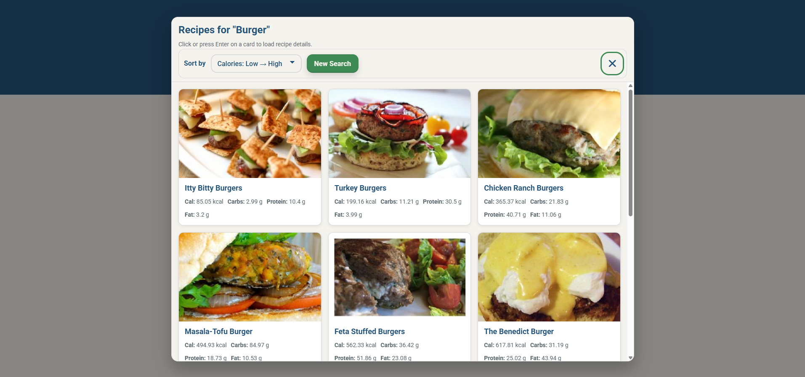
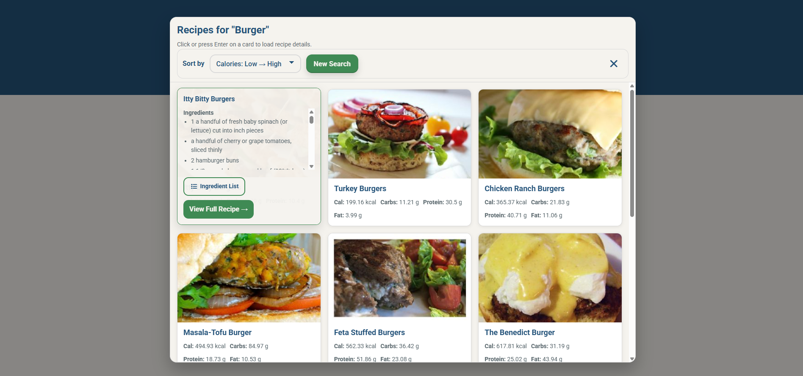
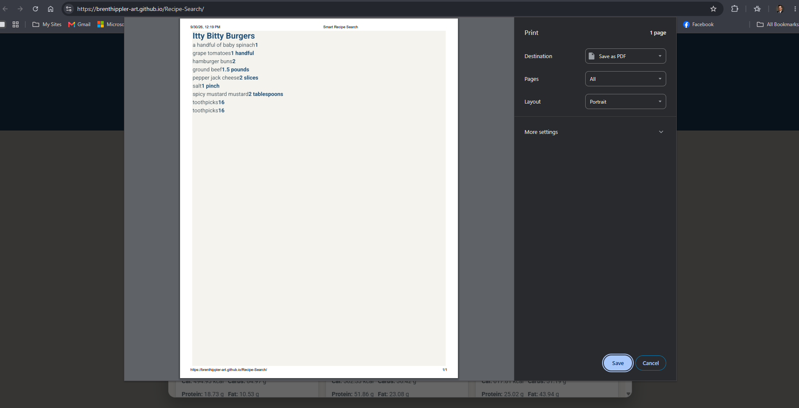

# Smart Recipe Search

A recipe discovery app. Search by ingredient or dish name, sort results by calories or macronutrients, and pull up a printable ingredient list for any recipe. Built with a strong focus on accessibility.

**[Live site →](https://brenthippler-art.github.io/Recipe-Search/)**

## The problem

Finding a recipe that fits a nutrition goal usually means opening recipe after recipe to check the numbers. This app shows nutrition up front, lets you sort by it, and gives you a clean ingredient list you can print for shopping.

## My contribution

Solo build.

- Search by food name or ingredient
- Sorting by calories, carbs, protein, or fat, low to high or high to low
- A recipe detail overlay that loads ingredients and instructions only when a card is opened
- A printable, single-recipe ingredient list
- A contact modal and a mobile navigation drawer
- Two serverless functions that proxy all calls to the recipe API

## Tech stack

- **Frontend:** vanilla JavaScript, HTML5, CSS3 (BEM naming), Font Awesome
- **Data:** Spoonacular recipe API
- **Backend:** Node.js serverless functions on Vercel (`/api/search` and `/api/details`)

## Screenshots





## Technical decisions

### A serverless proxy instead of calling the API from the browser
Every request goes through two small Vercel functions instead of straight to the recipe API:

```
Browser → /api/search, /api/details (Vercel) → Spoonacular API
```

The API key stays on the server and never appears in client code. The proxy is also the one place to handle errors and shape responses before they reach the page.

### Load details on demand
Search results only include what the cards need. Ingredients and instructions are fetched when someone opens a recipe, which keeps the first search fast and avoids spending API calls on recipes nobody opens.

### No combined shopping list, on purpose
Ingredient lists are per recipe. Combining ingredients across recipes would mean parsing free-form text like "2 large eggs, beaten" and "1 egg," which is unreliable and would produce wrong amounts. A correct list for one recipe beats a messy list for several.

## Accessibility and testing

Built and audited against WCAG 2.1 AA, with several 2.2-level practices:

- A skip-to-content link for keyboard users
- Screen-reader live regions that announce search status, result counts, and errors
- Recipe cards that open with Enter or Space, with visible focus states throughout
- Focus trapping and focus return in both modals and the mobile drawer
- Semantic landmarks and roles (`role="search"`, `role="dialog"`, `aria-modal`)
- 44×44px minimum touch targets on every interactive control
- Reduced-motion support with `prefers-reduced-motion`
- Color contrast checked against AA thresholds (4.5:1 text, 3:1 UI components), and no information conveyed by color alone

**Known limitations:** some recipes are missing images, nutrition, or instructions, depending on what the API provides. There's no automated test suite yet.

## Setup

```bash
git clone https://github.com/brenthippler-art/Recipe-Search.git
cd Recipe-Search
```

There's no build step. Open `index.html` in a browser, or serve the folder with any static server (like the VS Code Live Server extension).

Search and details depend on the deployed proxy. To run your own, deploy the `api/` folder to Vercel and set an `APILAYER_KEY` environment variable with your own key.

## Live link

[brenthippler-art.github.io/Recipe-Search](https://brenthippler-art.github.io/Recipe-Search/)

## Author

**Brenton Hippler:** [Portfolio](https://brentoncodes.dev) · [LinkedIn](https://www.linkedin.com/in/brenton-hippler-818b6397) · [GitHub](https://github.com/brenthippler-art)